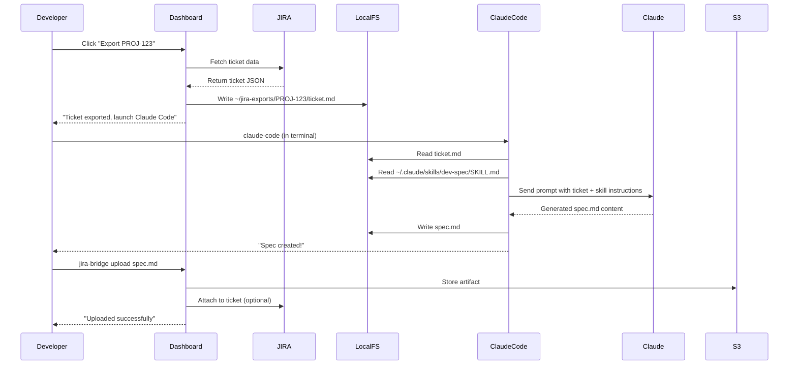
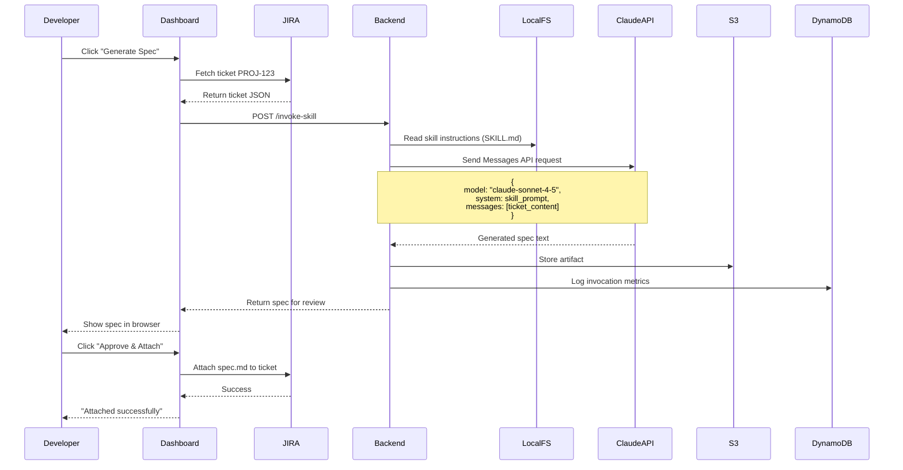

# Claude Integration Strategy Guide

## Overview

This guide explains the two approaches for integrating your Claude skills with APDevFlow, their tradeoffs, and when to use each.

**Product:** APDevFlow (AI-Powered DevFlow)  
**CLI:** `devflow` (primary) + `apdev` (alias)  
**Created by:** Aaron Prill, AP Dev Solutions

---

## The Two Approaches

### Approach 1: Claude Code (Local Developer Execution) ⭐ RECOMMENDED FOR MVP

#### How It Works

**Setup:**
1. Each developer installs Claude Code on their machine (free CLI tool)
2. Your custom skills are installed in `~/.claude/skills/`
3. Developer has an active Claude subscription (Pro, Team, or Enterprise)

**Daily Workflow:**
```bash
# Step 1: Export ticket from dashboard
$ devflow export PROJ-123
# Creates ~/jira-exports/PROJ-123/ticket.md

# Step 2: Navigate to workspace
$ cd ~/jira-exports/PROJ-123

# Step 3: Launch Claude Code
$ claude-code

# Step 4: Give instruction to Claude
> I have a story in ticket.md. Please use the dev-spec skill 
  to create an implementation specification.

# Step 5: Claude reads files, loads skill, generates spec.md
# (happens automatically, takes 1-2 minutes)

# Step 6: Review spec.md, make edits

# Step 7: Upload back to dashboard/JIRA
$ devflow upload spec.md --attach
```

**What's Happening Under the Hood:**



#### Pros
- ✅ **Zero API costs** - Developers use their existing Claude subscriptions
- ✅ **Skills work as-is** - Your skills already work in Claude Code
- ✅ **Developer control** - They can see exactly what Claude is doing
- ✅ **No credential management** - Dashboard doesn't need Claude API key
- ✅ **Works offline** - After export, developer can work disconnected
- ✅ **Familiar workflow** - Developers already use Claude Code for other tasks

#### Cons
- ❌ **Manual step** - Developer must run Claude Code themselves (not one-click)
- ❌ **Requires Claude subscription** - Each dev needs Pro ($20/mo) or Team
- ❌ **Hard to track centrally** - Can't measure usage unless developer uploads results
- ❌ **Environment variations** - Different Claude Code versions, different skill versions

#### Cost Model

**For the Organization:**
- AWS infrastructure: ~$30/month
- Claude API: $0
- **Total: $30/month** regardless of team size

**For Each Developer:**
- Claude Pro: $20/month (or Team/Enterprise plan)
- They use this for all their work, not just JIRA Bridge

**ROI Calculation (team of 20 developers):**
```
Time saved per developer per month: ~10 hours
Value of time: $50/hour (conservative)
Monthly value: 20 devs × 10 hrs × $50 = $10,000

Monthly cost: $30 (AWS) + ($20 × 20) (Claude subscriptions)* = $430
* Most devs already have Claude subscriptions for other work

Net value: $10,000 - $30 = $9,970/month
ROI: 33,000%
```

---

### Approach 2: Claude API (Centralized Execution)

#### How It Works

**Setup:**
1. Organization obtains Claude API key from Anthropic
2. API key stored in AWS Secrets Manager
3. Dashboard backend invokes Claude API directly
4. Skills adapted to work via API (prompt engineering)

**Daily Workflow:**
```bash
# From dashboard UI:
# Step 1: Select ticket PROJ-123
# Step 2: Click "Generate Spec" button
# (Backend does everything)
# Step 3: Review generated spec in browser
# Step 4: Click "Approve & Attach to JIRA"

# That's it - fully automated!
```

**What's Happening Under the Hood:**



#### Implementation Example

**Backend Lambda Function:**
```typescript
// lambda/skill-invoker.ts

import Anthropic from '@anthropic-ai/sdk';
import * as fs from 'fs';

interface InvokeSkillRequest {
  skillName: string;
  ticketId: string;
  ticketContent: JiraTicket;
}

export async function handler(event: InvokeSkillRequest) {
  // 1. Get Claude API key from Secrets Manager
  const apiKey = await getSecret('claude-api-key');
  const anthropic = new Anthropic({ apiKey });
  
  // 2. Load skill instructions
  const skillPath = `./skills/${event.skillName}/SKILL.md`;
  const skillPrompt = fs.readFileSync(skillPath, 'utf-8');
  
  // 3. Format ticket content for Claude
  const userMessage = formatTicketForSkill(event.ticketContent);
  
  // 4. Invoke Claude API
  const response = await anthropic.messages.create({
    model: 'claude-sonnet-4-5-20250929',
    max_tokens: 8000,
    system: skillPrompt, // Your skill instructions
    messages: [{
      role: 'user',
      content: userMessage, // The JIRA ticket
    }],
  });
  
  // 5. Extract generated content
  const generatedSpec = response.content[0].text;
  
  // 6. Store artifact
  await storeArtifact({
    ticketId: event.ticketId,
    content: generatedSpec,
    skillUsed: event.skillName,
    tokensUsed: response.usage,
    cost: calculateCost(response.usage),
  });
  
  // 7. Return for review
  return {
    success: true,
    artifact: generatedSpec,
    metadata: {
      tokensUsed: response.usage,
      cost: calculateCost(response.usage),
    },
  };
}

function formatTicketForSkill(ticket: JiraTicket): string {
  return `
# User Story

**Summary:** ${ticket.summary}

**Description:**
${ticket.description}

**Acceptance Criteria:**
${ticket.acceptanceCriteria.map(c => `- ${c}`).join('\n')}

**Story Points:** ${ticket.storyPoints || 'Not estimated'}

**Additional Context:**
- Sprint: ${ticket.sprint}
- Priority: ${ticket.priority}
- Related tickets: ${ticket.linkedIssues.join(', ')}

Please generate an implementation specification for this story.
  `.trim();
}

function calculateCost(usage: { input_tokens: number; output_tokens: number }): number {
  const INPUT_COST = 0.003 / 1000;  // $3 per 1M tokens
  const OUTPUT_COST = 0.015 / 1000; // $15 per 1M tokens
  
  return (usage.input_tokens * INPUT_COST) + (usage.output_tokens * OUTPUT_COST);
}
```

#### Skill Adaptation Required

Your current skills expect file system access. For Claude API, we need to adapt:

**Original Skill (Claude Code):**
```markdown
# dev-spec/SKILL.md

## Instructions

1. Read the user story from `ticket.md`
2. Read any additional context from `context.md`
3. Generate an implementation specification
4. Write the spec to `spec.md`

[... detailed instructions ...]
```

**Adapted Skill (Claude API):**
```markdown
# dev-spec/SKILL.md (API version)

## Instructions

You will receive a user story in the message. Generate an implementation
specification based on the following guidelines:

[... same detailed instructions ...]

## Output Format

Return only the specification content in markdown format. Do not include
any explanatory text or meta-commentary.
```

The core logic is the same, but:
- Input comes from message content, not file reads
- Output is returned as text, not file writes
- No file system operations

#### Pros
- ✅ **Fully automated** - One-click skill execution from browser
- ✅ **No developer prerequisites** - Works for anyone with browser access
- ✅ **Centralized tracking** - All usage, costs, metrics logged automatically
- ✅ **Consistent environment** - Same Claude version, same prompt for everyone
- ✅ **Batch processing** - Can process 100 tickets in parallel

#### Cons
- ❌ **Organization pays** - Claude API costs add up
- ❌ **Skills need adaptation** - Your existing skills need modification
- ❌ **API rate limits** - Must handle rate limiting, retries
- ❌ **Less transparency** - Developers don't see Claude's "thinking"
- ❌ **Credential management** - Need to secure API keys

#### Cost Model

**Claude API Pricing (as of November 2025):**
```
Model: claude-sonnet-4-5-20250929

Input:  $3 per 1M tokens
Output: $15 per 1M tokens

Typical dev-spec invocation:
- Input:  ~2,000 tokens (story + skill instructions)
- Output: ~4,000 tokens (generated spec)

Cost per spec:
= (2,000 × $3/1M) + (4,000 × $15/1M)
= $0.006 + $0.060
= $0.066 per spec
```

**Monthly Cost Estimate (team of 20 developers):**
```
Assumptions:
- 2 week sprints
- Each dev completes 5 stories per sprint
- Each story needs a spec

Monthly volumes:
- Stories: 20 devs × 5 stories × 2 sprints = 200 specs
- Monthly cost: 200 × $0.066 = $13.20

Additional usage (epic/feature breakdowns for POs):
- Epics: 5 per month @ $0.20 each = $1.00
- Features: 30 per month @ $0.10 each = $3.00

Total Claude API: ~$17/month
AWS infrastructure: ~$30/month

Total: $47/month for entire team
Per developer: $2.35/month
```

**ROI Calculation:**
```
Time saved per developer per month: ~10 hours
Value of time: $50/hour
Monthly value: 20 devs × 10 hrs × $50 = $10,000

Monthly cost: $47

Net value: $10,000 - $47 = $9,953/month
ROI: 21,170%
```

---

## Hybrid Approach (RECOMMENDED)

**Best of Both Worlds:**

| Use Case | Approach | Who Pays |
|----------|----------|----------|
| **Developers creating specs** | Claude Code | Developer (via subscription) |
| **Developers implementing code** | Claude Code | Developer (via subscription) |
| **POs breaking down epics** | Claude API | Organization ($1-2/month) |
| **Automated batch processing** | Claude API | Organization ($5-10/month) |

**Why This Works:**
1. **Developers already have Claude subscriptions** for their daily work
2. **POs don't need Claude subscriptions** - they just use the dashboard
3. **Organization only pays for automated workflows** that save the most time
4. **Total cost stays minimal** while maximizing flexibility

**Implementation:**
```typescript
interface HybridConfiguration {
  // Per skill setting
  skills: {
    'dev-spec': {
      mode: 'claude-code', // Developers use local Claude Code
      requiresApproval: false,
    },
    'dev-execute': {
      mode: 'claude-code',
      requiresApproval: false,
    },
    'epic-feature-creator': {
      mode: 'claude-api', // POs use automated API
      requiresApproval: true,
    },
    'feature-story-creator': {
      mode: 'both', // Allow either approach
      requiresApproval: true,
    },
  },
  
  // Budget controls
  claudeApi: {
    enabled: true,
    monthlyBudget: 50, // $50/month limit
    alertThreshold: 0.8, // Alert at 80% of budget
  },
}
```

**Cost Breakdown (Hybrid):**
```
AWS Infrastructure: $30/month
Claude API (PO workflows only): $10-15/month
Developer Claude subscriptions: $0 (they already have it)

Total organization cost: $40-45/month
```

---

## Decision Matrix

| Factor | Claude Code | Claude API | Hybrid |
|--------|-------------|------------|--------|
| **Setup complexity** | Low | Medium | Medium |
| **Developer experience** | Familiar, transparent | Unfamiliar, automated | Best of both |
| **Cost (org)** | $30/mo | $47/mo | $40/mo |
| **Cost (dev)** | $20/mo/dev* | $0 | $20/mo/dev* |
| **Time to MVP** | Fast (skills work as-is) | Slower (adapt skills) | Medium |
| **Scalability** | Limited by dev setup | Unlimited | Excellent |
| **Analytics** | Manual tracking | Automatic | Hybrid |
| **Offline support** | Yes | No | Yes (dev mode) |

*Most developers already have Claude subscriptions

---

## Recommendation for MVP

**Start with Claude Code:**

1. **Week 1-2: Core Infrastructure**
   - JIRA integration
   - Ticket export to local workspace
   - CLI tool for upload

2. **Week 3-4: Developer Workflow**
   - Skills work as-is (no adaptation needed)
   - Developers use familiar Claude Code
   - Zero API costs while validating product

3. **Week 5-6: Validate & Iterate**
   - Get feedback from developers
   - Measure actual time savings
   - Identify which workflows need automation

**Then Add Claude API Selectively:**

4. **Week 7-8: Planning Automation**
   - Add Claude API for epic-feature-creator
   - POs can use without Claude subscriptions
   - Batch processing for sprint planning

5. **Week 9+: Optimize**
   - Keep dev workflows in Claude Code
   - Use API for automated/batch operations
   - Monitor costs, adjust as needed

---

## Frequently Asked Questions

**Q: Can developers use the app without Claude subscriptions?**

A: With Claude Code approach (MVP), no - they need Claude Pro/Team. With Claude API approach, yes - the organization pays for API usage.

**Q: What happens if a developer doesn't have Claude Code installed?**

A: They can still export tickets and work manually, but won't get AI assistance. Or, organization can enable Claude API mode for those users.

**Q: Can we switch between Claude Code and Claude API later?**

A: Yes! The architecture supports both. You can even offer both options and let users choose.

**Q: How do we track usage if developers use local Claude Code?**

A: They upload artifacts back to dashboard, which logs the activity. We know a skill was used, but not detailed token usage.

**Q: What about rate limits?**

A: Claude API has generous rate limits (10,000 requests/minute for Sonnet). Claude Code has no limits (uses developer's subscription).

**Q: Can we self-host Claude?**

A: No, Claude is only available via Anthropic's hosted API or Claude.ai. Claude Code runs locally but still connects to Anthropic's servers.

---

## Next Steps

1. Review this strategy with team
2. Decide: MVP with Claude Code or go straight to hybrid?
3. If Claude Code MVP:
   - Create developer setup guide
   - Document skill installation process
   - Build CLI tool for export/upload
4. If Claude API:
   - Obtain API key from Anthropic
   - Adapt first skill (epic-feature-creator)
   - Implement backend skill invoker

---

**Questions?** Reach out to discuss which approach best fits your team's needs.
